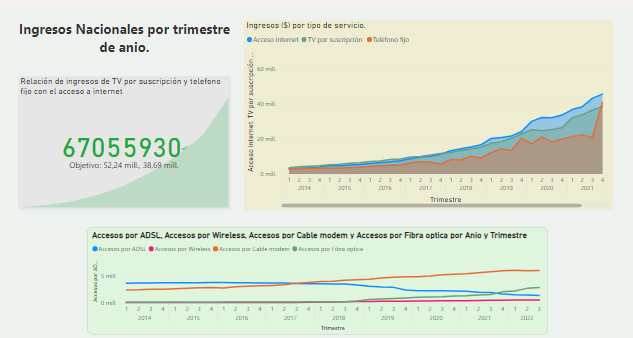

# KPIs para reconocer el comportamiento de telecomunicaciones en el país de Argentina

# **Introducción**
En un mundo cada vez más conectado, las telecomunicaciones se han convertido en pilares esenciales para el desarrollo económico, social y tecnológico de las naciones.

En este proyecto se va a explorar y examinar los datos relacionados a telecomunicaciones y principalmente al acceso de Internet.

# **Objetivos**

* Determinar 3 KPIs relacionados con oportunidades de crecimiento y buena calidad de servicios de una empresa prestadora.
* Realizar un EDA empleando gráficos y un analisis.
* Desarrollar un Dashboard por medio de Power BI.

# **Metodología**

# EDA
 
# Dashboard

# **Análisis**

Primero analicé de manera general valores de manera nacional por trimestre de año, los cuales fueron: accesos a internet por cada 100 hogares, velocidad de baja media, acesos por tipo de tecnología. De lo descrito anteriormente, el KPI que yo elegí fue  _`accesos a internet po 100 hogares`_, debido a que, este parámetro puede ser un indicador de acuerdo a la velociadad, si hay más accesos por hogar para un solo tipo de tecnología puede que la velocidad de bajada media sea mas lenta, y viceversa. Pero en este caso, podemos observar en la siguiente imagen que, la velocidad de bajada media incrementa, aún cuando los a accesos de Internet por cada 100 hogares crece. Así, se puede deducir que, esto es proporcional a los accesos por tecnología, donde aumentan mayormente, los accesos por tecnologías que brindar un servicio más rápido en cuanto a velocidad. 

Los accesos por hogares nos indican que tan bien esta funcionando el acceso a internet relacionado a velocidad media de bajada y a los tipos de tecnologías usadas.

Despues, analizaremos nuestro siguiente KPI, siendo el elegido los _`ingresos de las tecnologías ($)`_` que se ofrecen, para deducir si es bueno invertir en alguna de ellas.
Mi KPI tiene una meta, si los ingresos de las tecnologías ´ ´ Telefono fijo y Televisión porsuscripción (sumadas), tiene mayor ingreso que la variable de Acceso internet, se pasa al siguiente KPI, el cual es, analizar las tenológias por provincias para mejorar la infraestructura.
Coloqué los accesos por tecnologías,para relacionar los comportamientos relacionados _`TV por suscripción - Cable modem`_ y _`Telefono fijo`_ - ADSL, ya que, los accesos de internet dependen de ellos. 

