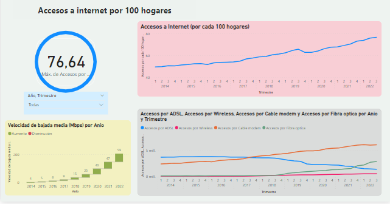

# KPIs para reconocer el comportamiento de telecomunicaciones en el país de Argentina

# **Introducción**
En un mundo cada vez más conectado, las telecomunicaciones se han convertido en pilares esenciales para el desarrollo económico, social y tecnológico de las naciones.

En este proyecto se va a explorar y examinar los datos relacionados a telecomunicaciones y principalmente al acceso de Internet.

# **Objetivos**

* Determinar 3 KPIs relacionados con oportunidades de crecimiento y buena calidad de servicios de una empresa prestadora.
* Realizar un EDA empleando gráficos y un analisis.
* Desarrollar un Dashboard por medio de Power BI.

# **Metodología**

# EDA

# Dashboard

# **Análisis**

Primero analicé de manera general algunos 

